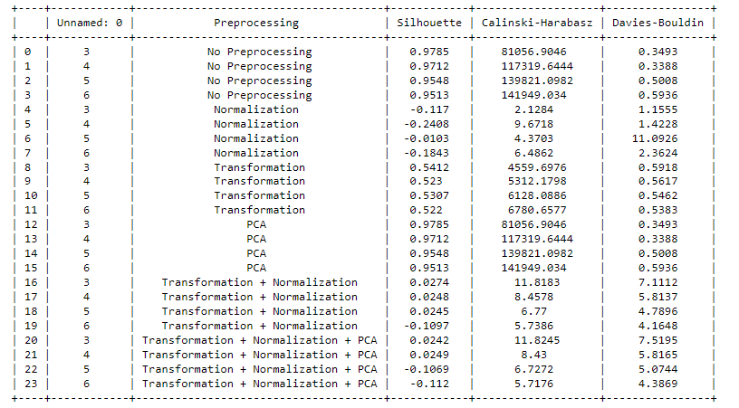
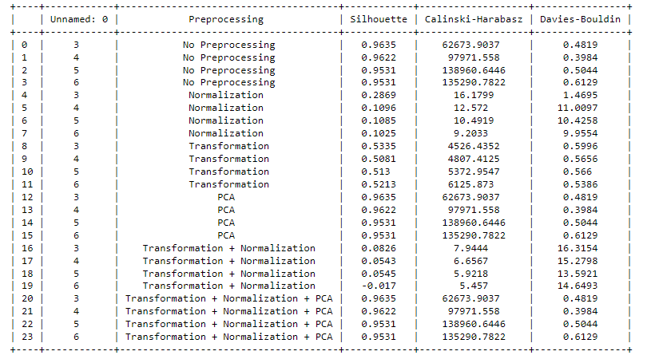
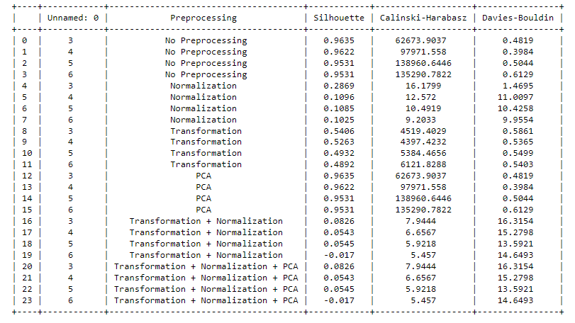

# Clustering Assignment - Elections Dataset

# Overview

This repository contains the implementation of different clustering algorithms on the Elections dataset using PyCaret. The goal is to explore the performance of clustering techniques with various pre-processing methods and evaluate them on different metrics.

## Dataset

The dataset used for this clustering assignment revolves around elections, capturing information about various political parties and their performance in different regions.

## Clustering Techniques

1. **K Means Clustering**
2. **Hierarchical Clustering**
3. **Birch Clustering**

## Evaluation Parameters

The clustering techniques are evaluated based on the following parameters:

1. **Silhouette Score**
2. **Calinski-Harabasz Index**
3. **Davies-Bouldin Index**

## Pre-Processing Techniques

Various pre-processing techniques are applied to the data before clustering:

1. **No Preprocessing:** Using the raw data without any pre-processing.
2. **Normalization:** Scaling the features to a standard range.
3. **PCA (Principal Component Analysis):** Reducing dimensionality using PCA.
4. **Transform:** Applying a transformation to the data.
5. **Scale:** Scaling the data using standard scaling.
6. **Normalization + Transformation:** Combining normalization and transformation techniques.
7. **Normalization + Transformation + PCA:** Combining normalization, transformation, and PCA techniques.

## Repository Structure

- **`notebooks/`:** Jupyter notebooks containing the code for each clustering technique and pre-processing method.
- **`data/`:** Folder containing the Elections dataset.
- **`results/`:** Folder containing the results and visualizations.
- **`README.md`:** This file providing an overview of the assignment.

## Results

1. KMeans Clustering

   

2. Hierarchical Clustering

   

3. Birch Clustering

   

## Conclusion

This assignment explores the application of clustering algorithms on the Elections dataset with various pre-processing techniques. The results and visualizations provide insights into the performance of different clustering methods under different scenarios.

Feel free to reach out for any questions or further discussions!
